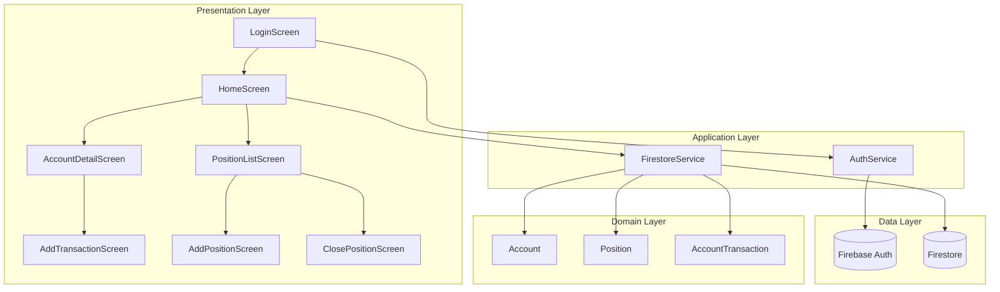
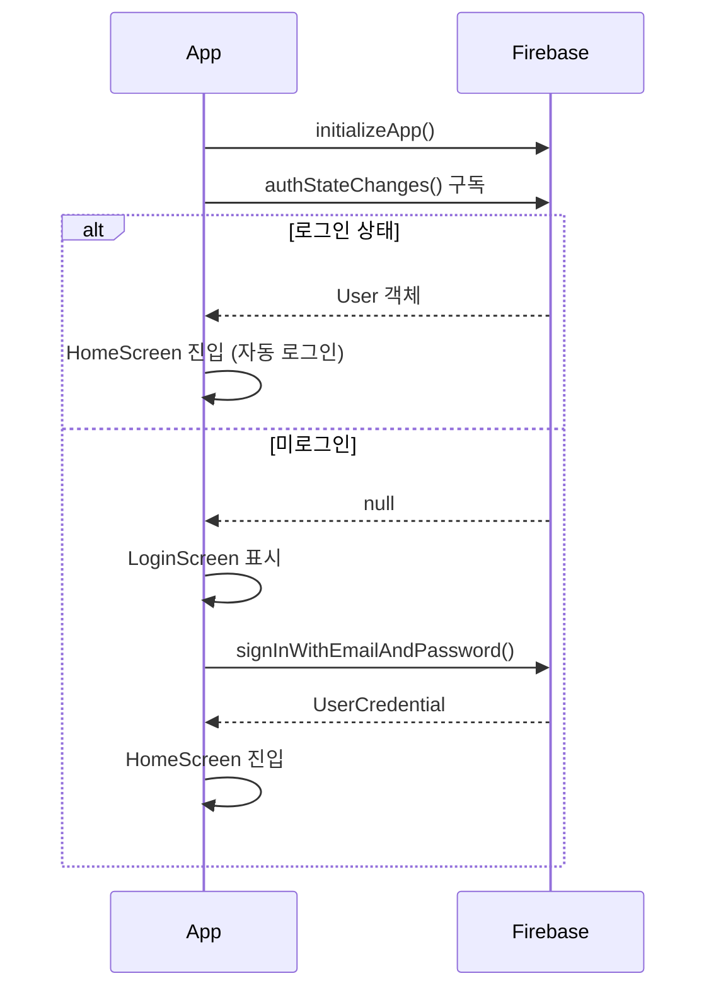

# Architecture

## 기술 스택

| 레이어 | 기술 |
|--------|------|
| UI (Presentation) | Flutter (Material 3) |
| 상태 관리 (Application) | StatefulWidget + StreamBuilder |
| 비즈니스 로직 (Domain) | Dart 모델 클래스 |
| 데이터 (Data) | Firebase Auth + Firestore |

---

## 시스템 다이어그램



---

## 디렉터리 구조

```
lib/
├── main.dart                        # 앱 진입점 · Firebase 초기화 · AuthWrapper
├── firebase_options.dart            # FlutterFire 자동 생성
│
├── models/                          # Domain Layer — 핵심 엔티티
│   ├── account.dart                 # 가상 계좌
│   ├── transaction.dart             # 입출금 내역
│   └── position.dart                # 포지션 (수익률·손익 계산 포함)
│
├── services/                        # Data Layer — 외부 시스템 연결
│   ├── auth_service.dart            # Firebase Auth 래퍼
│   └── firestore_service.dart       # Firestore CRUD · 잔액 계산
│
└── screens/                         # Presentation Layer — UI
    ├── auth/
    │   ├── login_screen.dart        # 이메일 로그인
    │   └── signup_screen.dart       # 회원가입
    ├── account/
    │   ├── add_account_screen.dart  # 계좌 등록
    │   ├── account_detail_screen.dart # 잔액 현황 · 입출금 목록
    │   └── add_transaction_screen.dart # 입금/출금 기록
    ├── position/
    │   ├── position_list_screen.dart # 포지션 목록 (보유중/정리)
    │   ├── add_position_screen.dart  # 포지션 기록
    │   └── close_position_screen.dart # 포지션 정리 · 수익률 확인
    └── home_screen.dart             # BottomNavigationBar 허브
```

---

## 인증 흐름



---

## Firestore 데이터 모델

```
users/{uid}/
  accounts/{accountId}
    name: string
    type: 'stock' | 'coin'
    initialBalance: number
    createdAt: timestamp

  accounts/{accountId}/transactions/{txId}
    type: 'deposit' | 'withdrawal'
    amount: number
    date: timestamp
    note: string?

  positions/{positionId}
    accountId: string
    symbol: string
    assetType: 'stock' | 'coin'
    entryPrice: number
    quantity: number
    entryDate: timestamp
    entryReason: string
    targetPrice: number?
    stopLoss: number?
    exitPrice: number?
    exitDate: timestamp?
    status: 'open' | 'closed'
```

---

## 각 레이어의 책임

| 레이어 | 책임 | 파일 위치 |
|--------|------|-----------|
| Presentation | 화면 렌더링, 사용자 입력 처리 | `screens/` |
| Application | 서비스 호출, 상태 관리 | `services/` |
| Domain | 비즈니스 규칙, 데이터 변환 | `models/` |
| Data | Firebase 통신, 직렬화/역직렬화 | `services/` + `models/toMap()` |
