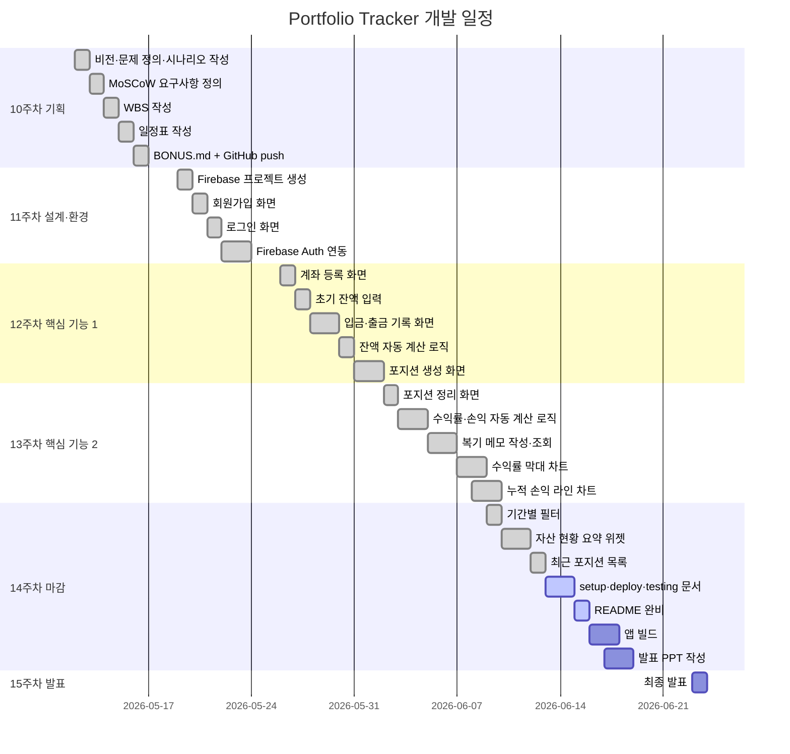
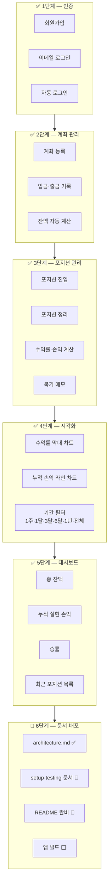
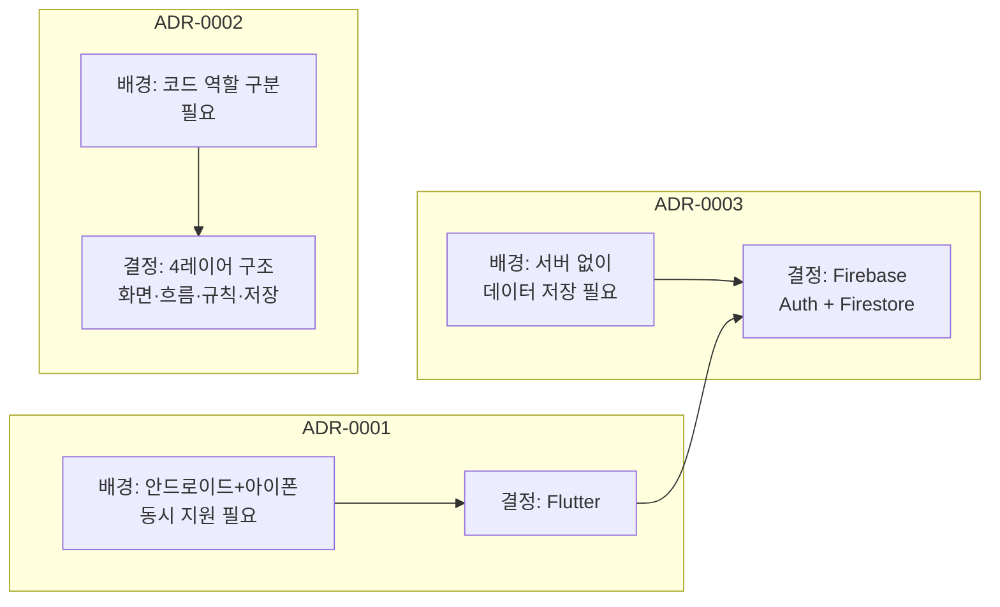

# Portfolio Tracker — 개발 진척도

## 주차별 진척도 (Gantt)

```mermaid
gantt
    title Portfolio Tracker 개발 일정
    dateFormat YYYY-MM-DD
    section 10주차 기획
    비전·문제 정의·시나리오 작성     :done, 2026-05-12, 1d
    MoSCoW 요구사항 정의             :done, 2026-05-13, 1d
    WBS 작성                         :done, 2026-05-14, 1d
    일정표 작성                      :done, 2026-05-15, 1d
    BONUS.md + GitHub push           :done, 2026-05-16, 1d

    section 11주차 설계·환경
    Firebase 프로젝트 생성           :done, 2026-05-19, 1d
    회원가입 화면                    :done, 2026-05-20, 1d
    로그인 화면                      :done, 2026-05-21, 1d
    Firebase Auth 연동               :done, 2026-05-22, 2d

    section 12주차 핵심 기능 1
    계좌 등록 화면                   :done, 2026-05-26, 1d
    초기 잔액 입력                   :done, 2026-05-27, 1d
    입금·출금 기록 화면              :done, 2026-05-28, 2d
    잔액 자동 계산 로직              :done, 2026-05-30, 1d
    포지션 생성 화면                 :done, 2026-05-31, 2d

    section 13주차 핵심 기능 2
    포지션 정리 화면                 :done, 2026-06-02, 1d
    수익률·손익 자동 계산 로직       :done, 2026-06-03, 2d
    복기 메모 작성·조회              :done, 2026-06-05, 2d
    수익률 막대 차트                 :done, 2026-06-07, 2d
    누적 손익 라인 차트              :done, 2026-06-08, 2d

    section 14주차 마감
    기간별 필터                      :done, 2026-06-09, 1d
    자산 현황 요약 위젯              :done, 2026-06-10, 2d
    최근 포지션 목록                 :done, 2026-06-12, 1d
    setup·deploy·testing 문서        :active, 2026-06-13, 2d
    README 완비                      :active, 2026-06-15, 1d
    앱 빌드                          :2026-06-16, 2d
    발표 PPT 작성                    :2026-06-17, 2d

    section 15주차 발표
    최종 발표                        :2026-06-23, 1d
```

---

## 기능별 구현 현황

```mermaid
flowchart TD
    subgraph AUTH["✅ 1단계 — 인증"]
        A1[회원가입]
        A2[이메일 로그인]
        A3[자동 로그인]
    end

    subgraph ACCOUNT["✅ 2단계 — 계좌 관리"]
        B1[계좌 등록]
        B2[입금·출금 기록]
        B3[잔액 자동 계산]
    end

    subgraph POSITION["✅ 3단계 — 포지션 관리"]
        C1[포지션 진입]
        C2[포지션 정리]
        C3[수익률·손익 계산]
        C4[복기 메모]
    end

    subgraph CHART["✅ 4단계 — 시각화"]
        D1[수익률 막대 차트]
        D2[누적 손익 라인 차트]
        D3[기간 필터\n1주·1달·3달·6달·1년·전체]
    end

    subgraph DASHBOARD["✅ 5단계 — 대시보드"]
        E1[총 잔액]
        E2[누적 실현 손익]
        E3[승률]
        E4[최근 포지션 목록]
    end

    subgraph DOCS["🔄 6단계 — 문서·배포"]
        F1[architecture.md ✅]
        F2[setup·testing 문서 🔄]
        F3[README 완비 🔄]
        F4[앱 빌드 ⬜]
    end

    AUTH --> ACCOUNT --> POSITION --> CHART --> DASHBOARD --> DOCS
```

---

## 기술 결정 (ADR 요약)

```mermaid
flowchart LR
    subgraph ADR1["ADR-0001"]
        P1["배경: 안드로이드+아이폰\n동시 지원 필요"]
        D1["결정: Flutter"]
    end

    subgraph ADR2["ADR-0002"]
        P2["배경: 코드 역할 구분\n필요"]
        D2["결정: 4레이어 구조\n화면·흐름·규칙·저장"]
    end

    subgraph ADR3["ADR-0003"]
        P3["배경: 서버 없이\n데이터 저장 필요"]
        D3["결정: Firebase\nAuth + Firestore"]
    end

    P1 --> D1
    P2 --> D2
    P3 --> D3
    D1 --> D3
```
