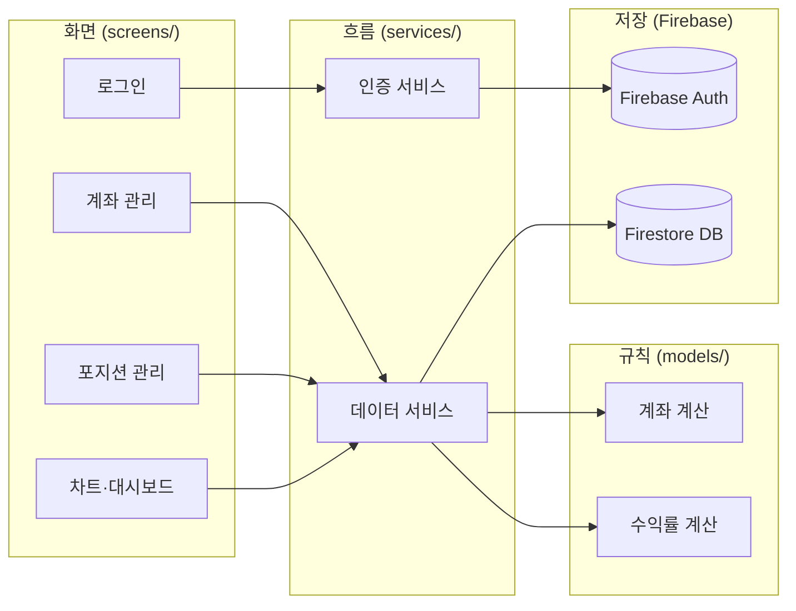

<!-- _class: title -->

# Portfolio Tracker

**되돌아보는 투자자가 앞으로 나아간다**

주성현 · 앱 프로그래밍 응용 · 중간 발표

---

## 문제 정의

<div class="problem-box">
❶ 투자 데이터가 여러 계좌에 흩어져 전체 현황 파악이 안 됨
</div>
<div class="problem-box">
❷ 체계적인 기록 수단이 없어 <b>매수 근거를 잊어버리고 복기가 불가능</b>
</div>
<div class="problem-box">
❸ 복기 없이 같은 실수가 반복됨 — 경험이 쌓이지 않음
</div>

<br>

<div class="highlight">
💡 <b>해결:</b> 포지션을 기록하고, 결과와 비교하고, 복기하는 도구
</div>

---

## 앱 소개

| 기능 | 설명 |
|------|------|
| 가상 계좌 관리 | 계좌 등록·입출금·잔액 자동 계산 |
| 포지션 기록 | 매수 근거·목표가·손절가까지 기록 |
| 수익률 계산 | 포지션 정리 시 수익률·손익 자동 계산 |
| 복기 메모 | 정리 후 잘한 점·아쉬운 점 기록 |
| 그래프 시각화 | 수익률 막대·누적 손익 선 그래프 (기간 필터) |
| 대시보드 | 총 잔액·누적 손익·승률 한눈에 확인 |

---

## 기술 선택 — ADR 요약

| ADR | 주차 | 결정 | 핵심 이유 |
|-----|------|------|-----------|
| 0001 | 10주차 | Flutter | 코드 1벌로 안드로이드·아이폰 동시 출시 |
| 0002 | 11주차 | 4개 역할로 코드 분리 | 오류 원인 파악 빠름, 유지보수 용이 |
| 0003 | 12주차 | Flutter 기본 기능 | 8개 화면 규모에서 외부 도구 불필요 |
| 0004 | 13주차 | Firebase | 서버 없이 로그인·저장 동시 해결 |
| 0005 | 14주차 | fl_chart | 완전 무료, 필요한 그래프 모두 지원 |

---

## 설계 — 앱 구조 (아키텍처)



---

## 현재 구현 현황

| WBS | 항목 | 상태 |
|-----|------|------|
| 1.1 ~ 1.4 | 로그인·회원가입·자동 로그인 | ✅ |
| 2.1 ~ 2.4 | 계좌 등록·입출금·잔액 계산 | ✅ |
| 3.1 ~ 3.4 | 포지션 기록·정리·복기 메모 | ✅ |
| 4.1 ~ 4.3 | 그래프·기간 필터 | ✅ |
| 5.1 ~ 5.2 | 대시보드 | ✅ |
| 6.1 ~ 6.3 | setup·architecture·README | ✅ |

**전체 WBS 90% 완료**

---

## 데모 흐름

```
관리자 로그인
    ↓
계좌 등록 (계좌명 · 종류 · 초기 잔액)
    ↓
입금 기록 → 잔액 자동 계산 확인
    ↓
포지션 기록 (종목 · 진입가 · 수량 · 매수 근거 · 목표가 · 손절가)
    ↓
포지션 정리 → 수익률 · 손익 자동 계산 확인
    ↓
복기 메모 작성
    ↓
차트 탭 → 막대 그래프 · 선 그래프 확인
```

---

## 예상 Q&A

<div class="qa-box">
Q1. <b>Flutter 말고 다른 방법은 없었나요?</b><br>
→ React Native와 안드로이드 전용 개발을 고려했습니다. 그러나 1인 개발에서 안드로이드·아이폰을 따로 만드는 것은 불가능하고, React Native는 구글 Firebase와 연결이 더 복잡해서 Flutter를 선택했습니다.
</div>

<div class="qa-box">
Q2. <b>코드를 왜 4개로 나눴나요?</b><br>
→ 오류가 발생했을 때 화면 문제인지, 계산 문제인지, 저장 문제인지 원인을 빠르게 좁힐 수 있고, 한 부분을 고쳐도 다른 기능이 망가지지 않아 유지보수가 편하기 때문입니다.
</div>

<div class="qa-box">
Q3. <b>Firebase 말고 직접 서버를 만들면 안 되나요?</b><br>
→ 직접 서버를 만들면 서버 운영 비용이 생기고 7주 안에 완성하기 어렵습니다. Firebase는 서버 없이 로그인과 데이터 저장을 동시에 해결하고, Flutter와 공식적으로 가장 잘 맞습니다.
</div>

---

## 남은 계획

| 주차 | 작업 |
|------|------|
| 13주차 | 포지션 정리 고도화 · 차트 완성 |
| 14주차 | 대시보드 완성 · 문서 완비 · 앱 빌드 |
| 15주차 | 최종 발표 |

---

<!-- _class: title -->

# 감사합니다

Q & A
